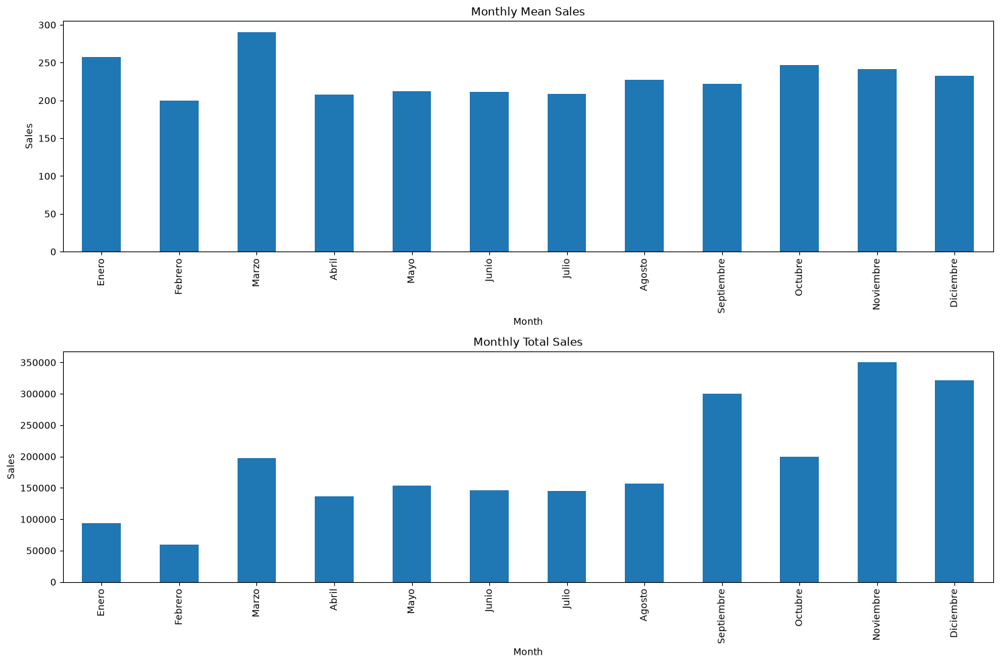
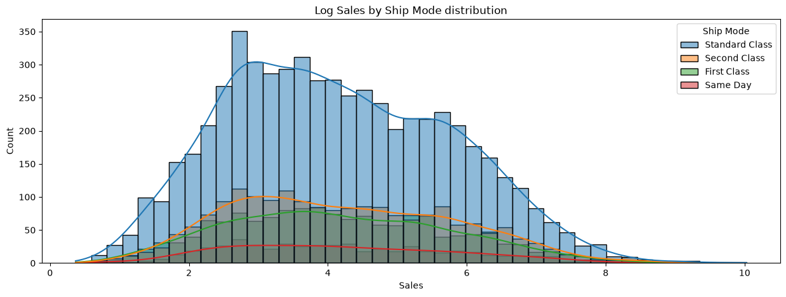
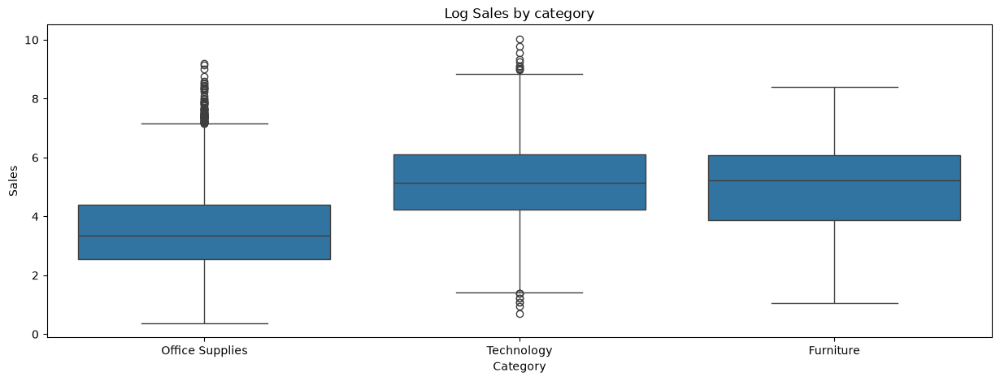
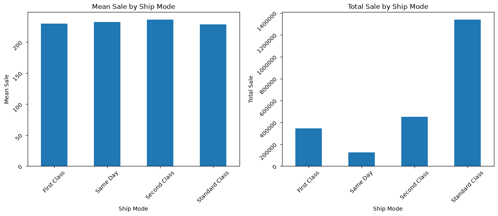
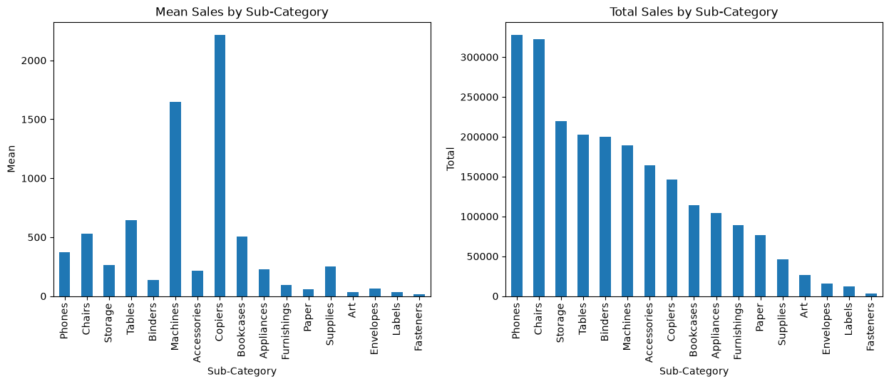
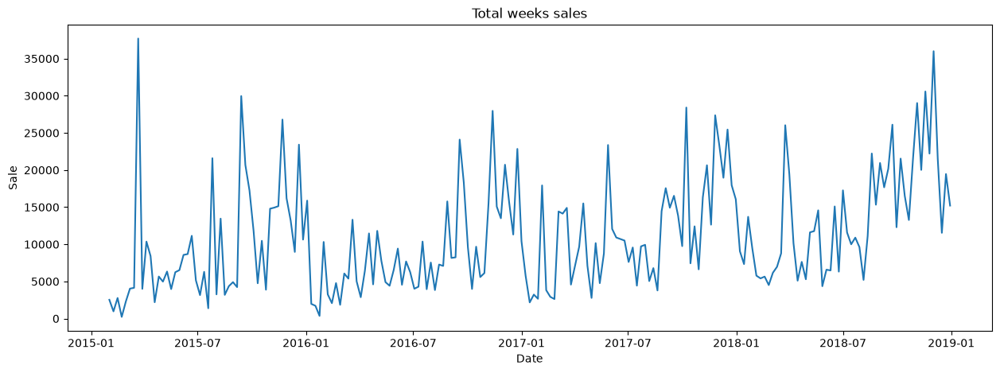
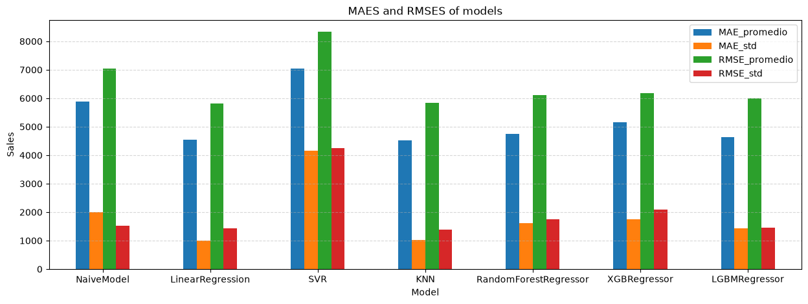
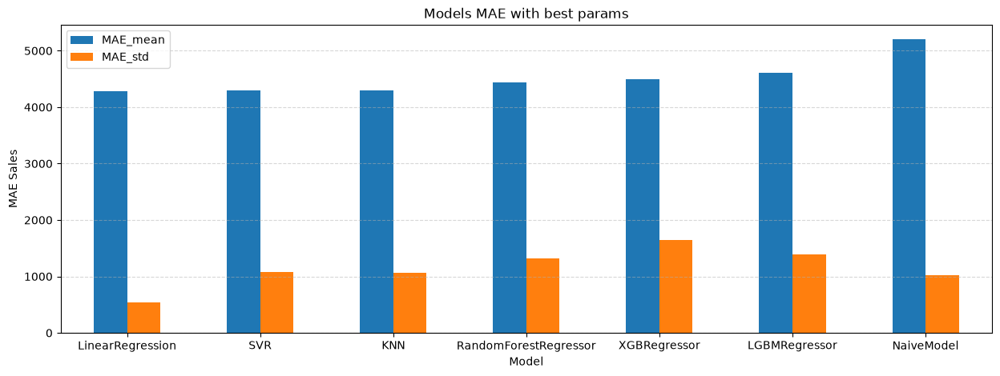
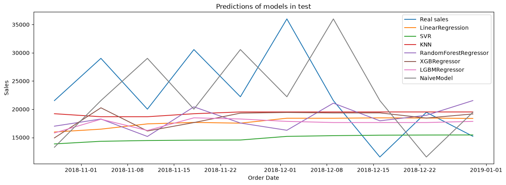
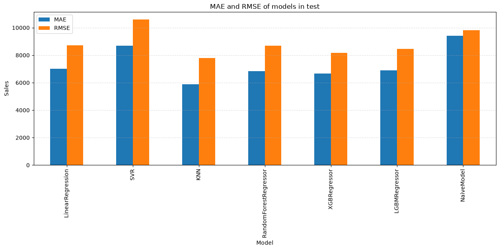

# 🧪 Proyecto de análisis en Superstore Sales
## ❓ Planteamiento del problema
Un hipermercado quiere saber el comportamiento de sus ventas, analizando factores como lo son los productos que mas se venden, en que regiones tienen mas compradores, distribuciónes, etc. Todo esto para poder aprovechar de mejor manera sectores de compradores habitulaes, identificar productos mas vendidos, entre otros indicadores. Este análisis también permite señalar tendencias e incluso tener en conocimiento que factores puedan reportar poca eficiencia, con el fin de tomar decisiones.

## ℹ️ Dataset
Recurso: Kaggle

Link: https://www.kaggle.com/datasets/rohitsahoo/sales-forecasting

Registros: 9800 

Categorías interesantes:
- Sales
- Order Date
- Region
- State
- City
- Sub-category

## 🎯 Objetivos
- Detectar comportamiento del mercado a lo largo del tiempo
- Identificar productos que generan mayores ganancias
- Analizar zonas y segmentos mas contribuyentes

## 🧹 Limpieza de datos
- Transformar columnas 'Order Date' y 'Ship Date' a un formato de tiempo
- Eliminar carcterísticas con representación de ID'S
- Eliminar columna 'Product Name' debido a su info. no general que nos da (demasiada granularidad).
- Eliminar feature 'Postal Code' debido a que está fuertemente dado por 'Country', 'City' y 'State'
- Eliminar feature 'Customer Name' ya que el nombre de los clientes varía mucho y para efectos del análisis no contempla un cliente frecuente.
- Ordenar 'Order Date' y convertirlo en el índice.

## 🔎 EDA
Cabe señalar que los gráficos mostrados a continuación corresponden a los principales descubrimientos y factores que puedan dar una señal importante sobre el comportamiento o que puedan ser de ayuda para la toma de decisiones.

### Total sales by month
- Las ventas totales de cada mes representan un patrón relativamente notable, tendiendo al alza.
- Los meses anteriores a fin de año proporcionan un claro aumento de las ganancias de manera habitual.
- Los meses posteriores a año nuevo representan una fuerte caída.
- El último año de observación ha sido especialmente bueno con respecto a los anteriores.

### Sales distribution
- Las ventas de cada día estan fuertemente sesgadas por debajo de los $1,500
- Esto sugiere que el comprador habitual de la tienda no contempla gastos muy elevados, sin dejar de lado que existen unos pocos (probablemente entidades grandes) que de vez en cuando realizan una compra muy alta.

### Mean and Totales sales by month
Acá podemos ver más claramente como los meses cercanos a fin de año (a excepcion de Octubre) suman las mayores ganancias. Aunque el mes de Marzo tiende a tener cada venta más cara que el resto, pero queda por debajo en ventas totales, esto se puede deber a compras poco frecuentes pero altas.

### Sales distribution in categories
Como veremos en el siguiente gráfico (con logaritmo aplicado a las ventas para poder notar tendencias debido al sesgo) las ventas de cada categoría no varias mucho entre sí, esto ocurre en unos cuantos features.

En este caso lo que más marca la diferencia entre features categóricos es la frecuencia de las compras, por ejemplo utilizando igualmente como en el gráfico anterior el 'Ship Mode' podemos notar que 'Standard Class' es el Ship Mode más frecuente con bastante diferencia en comparación a los otros.

Ahora aqui tenemos un gráfico con logaritmo de ventas, por la naturaleza del logarítmo aplicado, no se pueden aproximar a ventas reales, pero si nos da un indicio de que la categoría 'Office Supplies' tiende a tener ventas mas bajas que las otras 2, aunque si con bastantes comprar atípicas.

### Mean and Total sales in categories
Ahora compararemos en varios features cuales son sus ventas promedio y cuanto en total han generado cada categoría del feature a la tienda.

Aquí podemos corroborar que todos los Ship Mode tienen una venta promedio muy parecida, el cambio está en qué frecuencia compran los clientes con cada 'Ship Mode'. Donde se puede notar que la 'Standard Class' es la favorita por los usuarios. Es importante pensar que, las entregas en el mismo día si bien podrían ser "mejores" al ser más rápidas, de todas formas las personas no utilizan esa opción.

El fenómenos de features con ventas promedio caras pero beneficio pequeño y biceversa, se da en otras ocaciones, para más información, ver gráficos del 28 al 35. Este es otro ejemplo con 'Sub-Category' en donde si bien la venta promedio de 'Phones' es relativamente baja, supone una gran parte de las ventas totales de la tienda y por ende, una mayor frecuencia de compra.

## 👁️ General keys insights
- Aunque la tendencia general va al alza, se puede notar períodos fuertes anteriores a fin de año, que caen inmediatamente a principios del año siguiente.
- Las ventas en general tienden a estar por debajo de los $1,500 aunque existen ventas fuertes, pero son excepciones muy aisladas.
- Las mayores diferencias entre categorías de los features no son por tendencias de compras más caras o más baratas, si no que la desigualdad radica en la frecuencia de compra de tales productos o tipos de envío.
- A pesar de tener las ventas unitarias en promedio más altas, Detroit es el 'City' con las menores ventas totales.
- Existen 'Sub-Category' como Labels y Fasteners que además de una venta promedio baja, tampoco han aportado muchas ganancias totales a la tienda.

## ⚙️ Feature engineering
En primer lugar hay que señalar que el modelamiento predictivo se va a enfocar en estimar las ventas de las 10 últimas semanas del dataset.

Así es como se ven las ventas totales semana a semana.

### Lag/rolling
- Se han creado features de lag del 1 al 4, es decir las ventas de la semana inmediatamente pasada y hasta 4 semanas atrás.

- Además se crea el feature de Rolling_4 para obtener el promedio de las 4 últimas semanas.

- Para cada semana se extraen las características del mes y año correspondiente.

## 🤖 ML
El trabajo con machine learning se divide en 3 secciones marcadas, las cuales son un modelado con algoritmos con hiperparámetros por defecto, otro con uso de GridSearchCV y en la tercera etapa probar modelos con mejores hiperparámetros en test.

### Default models
Para realizar esta evaluación se ha separado la información de data para evaluar los modelos en 5 períodos de tiempo distintos, esto con el fin de saber el comportamiento de los modelos de manera más fidedigna y que el resultado no esté dado por una coincidencia de buena predicción en las últimas 10 semanas.

Los modelos utilizados son los siguientes:
- NaiveModel (este modelo simplemente se ha creado prediciendo las ventas de la semana pasada siempre, sirve como baseline, los otros modelos deben ser por lo menos mejores que este)
- LinearRegression
- SVR
- KNN
- RandomForestRegressor
- XGBRegressor
- LGBMRegressor

Los resultados indican que en promedio los modelos se equivocan unos $1,500 menos que la técnica de predecir siempre las ventas de la semana pasada. Aunque SVR en este caso funciona peor que el modelo ingenuo.

### GridSearchCV
Ahora se ha separado inicialmente las últimas 10 semanas, por lo que se van a trabajar con el total_semanas-10

El modelo lineal es que más mejoría tiene con respecto a los otros modelos, además que su error promedio no varía tanto.

### Models tuned predictions in test
Podemos ver las predicciónes para las últimas 10 semanas de cada uno de los modelos tuneados.

Y ahora evaluamos mae y rmse de cada modelo entrenado, para las últimas 10 semanas (target final). Se puede apreciar como para este caso en específico final, el mejor modelo con los errores promedio menores es el modelo KNN.

Finalmente podemos concluir que los modelos más confiables son el LinearRegression considerando las ventas históricas y para el último período de la tienda, el mejor predictor es el modelo KNN.

## 🏆 Business recomendations
- Analizar capacidad de la superstore para producir los productos. Debido al posible aumento de la demanda en el futuro medianamente cercano.
- Considerar el gasto que involucra generar productos con categorías como 'Fasteners', 'Labels', 'Envelopes' y 'Art' ya que historicamente no han generado mucha ganancia.
- Incentivar la compra de productos en 'City' como 'Detroit' y 'Jacksonville' ya que tienen de las compras unitarias más caras pero con menores ventas totales.
- Mejorar estrategias de ventas o marketing en estados que pertenezcan a 'South'
- Darle prioridad en stock a productos con mayor cantidad de ventas (sobre todo para Binders y Paper)

## 👤 Autor
Carlos Rojas
