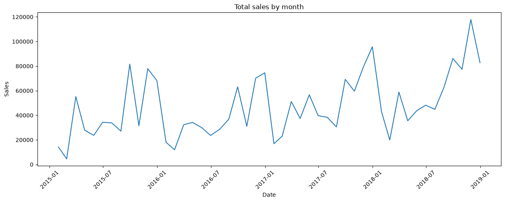
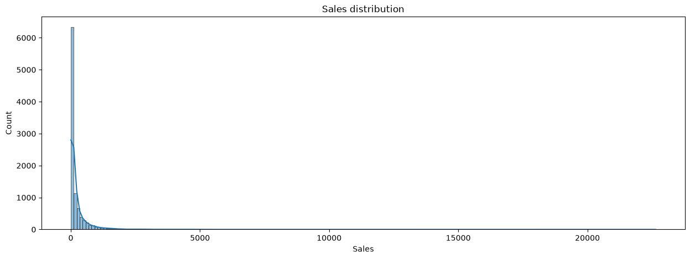
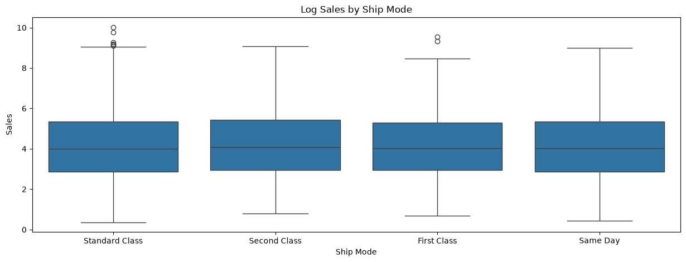

# 🧪 Proyecto de análisis en Superstore Sales
## ❓ Planteamiento del problema
Un hipermercado quiere saber el comportamiento de sus ventas, analizando factores como lo son los productos que mas se venden, en que regiones tienen mas compradores, distribuciónes, etc. Todo esto para poder aprovechar de mejor manera sectores de compradores habitulaes, identificar productos mas vendidos, entre otros indicadores. Este análisis también permite señalar tendencias e incluso tener en conocimiento que factores puedan reportar poca eficiencia, con el fin de tomar decisiones.

## ℹ️ Dataset
Recurso: Kaggle

Link: https://www.kaggle.com/datasets/rohitsahoo/sales-forecasting

Registros: 9800 

Categorías interesantes:
- Sales
- Order Date
- Region
- State
- City
- Sub-category

## 🎯 Objetivos
- Detectar comportamiento del mercado a lo largo del tiempo
- Identificar productos que generan mayores ganancias
- Analizar zonas y segmentos mas contribuyentes

## 🧹 Limpieza de datos
- Transformar columnas 'Order Date' y 'Ship Date' a un formato de tiempo
- Eliminar carcterísticas con representación de ID'S
- Eliminar columna 'Product Name' debido a su info. no general que nos da (demasiada granularidad).
- Eliminar feature 'Postal Code' debido a que está fuertemente dado por 'Country', 'City' y 'State'
- Eliminar feature 'Customer Name' ya que el nombre de los clientes varía mucho y para efectos del análisis no contempla un cliente frecuente.
- Ordenar 'Order Date' y convertirlo en el índice.

## 🔎 EDA
Cabe señalar que los gráficos mostrados a continuación corresponden a los principales descubrimientos y factores que puedan dar una señal importante sobre el comportamiento o que puedan ser de ayuda para la toma de decisiones.

### Total sales by month
- Las ventas totales de cada mes representan un patrón relativamente notable, tendiendo al alza.
- Los meses anteriores a fin de año proporcionan un claro aumento de las ganancias de manera habitual.
- Los meses posteriores a año nuevo representan una fuerte caída.
- El último año de observación ha sido especialmente bueno con respecto a los anteriores.

### Sales distribution
- Las ventas de cada día estan fuertemente sesgadas por debajo de los $1,500
- Esto sugiere que el comprador habitual de la tienda no contempla gastos muy elevados, sin dejar de lado que existen unos pocos (probablemente entidades grandes) que de vez en cuando realizan una compra muy alta.

### Sales distribution in categories
Como veremos en el siguiente gráfico (con logaritmo aplicado a las ventas para poder notar tendencias debido al sesgo) las ventas de cada categoría no varias mucho entre sí, esto ocurre en unos cuantos features.

En este caso lo que más marca la diferencia entre features categóricos es la frecuencia de las compras, por ejemplo utilizando igualmente como en el gráfico anterior el 'Ship Mode' podemos notar que 'Standard Class' es el Ship Mode más frecuente con bastante diferencia en comparación a los otros.

## 👁️ Insights claves generales
- Las ventas estan concentradas significativamente en 10-11 estados que son los que aportan mas ganancias, conformando un 71.8% de las ganancias de la superstore
- Los periodos de Septiembre y Diciembre son los mejores para generar ganancias a la superstore, además que esta va en un crecimiento favorable
- Productos con sub-categorias como: Appliances, Labels, Tables, Envelopes, Bookcases, Fasteners, Supplies, Machines, Copiers. No es necesario tener mas de 500 productos disponibles para cada uno en un período de 4 años

## 🏆 Recomendaciones finales
- Analizar capacidad de la superstore para producir los productos. Debido al posible aumento de la demanda en el futuro medianamente cercano.
- Darle prioridad en stock a productos con mayor cantidad de ventas (sobre todo para Binders y Paper)
- Mejorar estrategias de ventas o marketing en estados que pertenezcan a 'South'
- Mantener trabajo realizado en estados como California y New York, mejorar un poco las estrategias en estados como Texas, Washington y Pennsylvania. Ver estrategias de mejora de alto impacto para todo el resto de estados.

## 👤 Autor
Carlos Rojas
